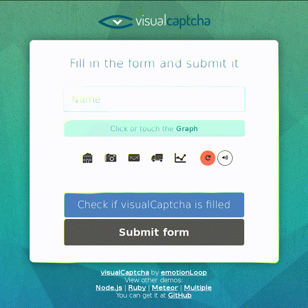

visualCaptcha Bot
=================

Automate [visualCaptcha](http://visualcaptcha.net/), "the best captcha
alternative".

Overview
--------



Description
-----------

I just wanted to show how easy it is to automate the visualCaptcha solution.

After adding the bookmarklet, go to <http://demo.visualcaptcha.net/> and
launch it (or just copy the script in the JavaScript console). The right
image should be automatically selected.

You can renew the challenge and test it again and again. It will work with
a 100% success rate unless new images were added since I computed the
images list.

Installation
------------

Add this bookmarklet and run it on a page containing a visualCaptcha
(or just paste it in the JavaScript console).

Note: if you use NoScript, you'll have to (temporarily) allow
`www.myersdaily.org` and `raw.githubusercontent.com`.

```js
(function(){function a(a,b){var c=document.createElement("script");c.src=a,c.onload=b,document.head.appendChild(c)}function b(b){"md5"in window?b():a("http://www.myersdaily.org/joseph/javascript/md5.js",b)}function c(b){"visualCaptchaBot"in window?b():a("https://raw.githubusercontent.com/valeriangalliat/visualcaptcha-bot/master/bot.js",b)}function d(){visualCaptchaBot.main()}b(c.bind(this,d))}());
```

Actual bookmarklet source:

```js
(function () {
    function addScript(src, cb) {
        var script = document.createElement('script');
        script.src = src;
        script.onload = cb;
        document.head.appendChild(script);
    }

    function a(cb) {
        if (!('md5' in window)) {
            addScript('http://www.myersdaily.org/joseph/javascript/md5.js', cb);
        } else {
            cb();
        }
    }

    function b(cb) {
        if (!('visualCaptchaBot' in window)) {
            addScript('https://raw.githubusercontent.com/valeriangalliat/visualcaptcha-bot/master/bot.js', cb);
        } else {
            cb();
        }
    }

    function c() {
        visualCaptchaBot.main();
    }

    a(b.bind(this, c));
}());
```

Process
-------

To begin, the list of challenge images associated to their MD5 sum is
retrieved with the following shell script:

```sh
git clone https://github.com/emotionLoop/visualCaptcha-packagist.git
cd visualCaptcha-packagist/src/visualCaptcha/assets/images

find . -not -name '*@2x.png' -name '*.png' \
    | xargs md5sum \
    | awk '
        BEGIN {
            print "{"
        }

        {
            print " \"" $1 "\": \"" substr($2, 3, length($2) - 6) "\","
        }

        END {
            print "}"
        }
    '
```

The bookmarklet loads a JavaScript MD5 function, needed to compare an
image data to the previously computed list.

Then, the `bot.js` script will loop through all `.visualCaptcha` elements
and try to fill them.

The target MD5 sum is the precomputed sum for the current challenge; if
the challenge says to find a clip, we can lookup for the `clip` key in the
static list.

Then, the steps are the following:

* get each image URL,
* get the binary image data in a blob,
* compute the MD5 sum,
* compare it to the target MD5 sum.

When the sum match, we can just simulate a click on the right image.

Misc
----

Commands used to generate the GIF:

```sh
W=1680
H=1050
L=$(((W - 768) / 2))

ffmpeg -f x11grab -s "$Wx$H" -i :0.0+nomouse -vf "crop=768:768:$L:0, scale=512:512" bot.gif
```
